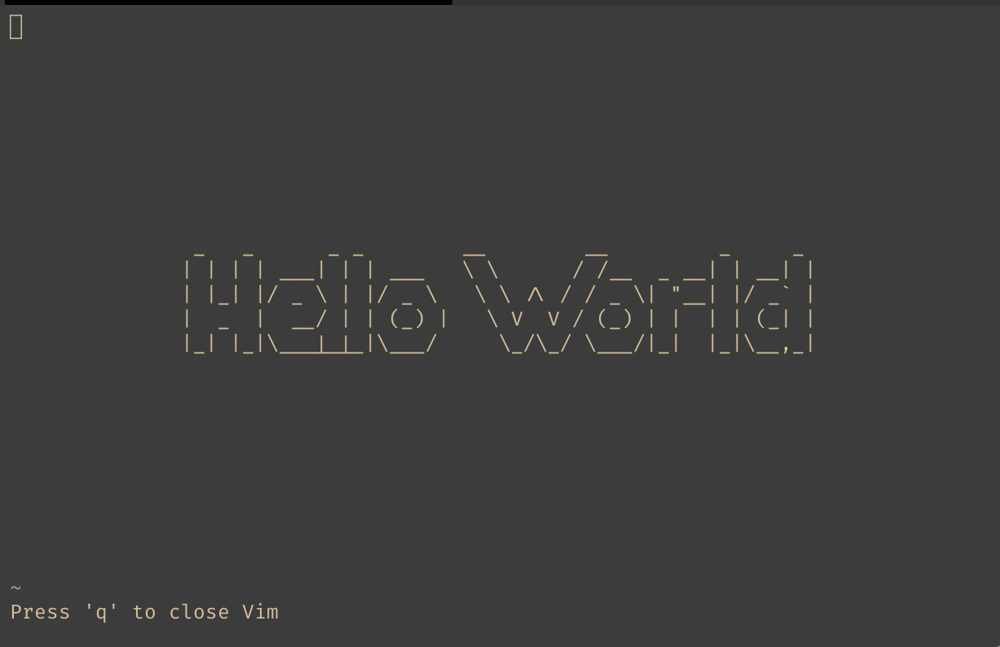

# 基于 Vim 的 Hello World

## Vim

Vim是从vi发展出来的一个文本编辑器。其代码补完、编译及错误跳转等方便编程的功能特别丰富，在程序员中被广泛使用。和Emacs并列成为类Unix系统用户最喜欢的编辑器。

Vim的第一个版本由布拉姆·莫勒纳尔在1991年发布。最初的简称是Vi IMitation，随着功能的不断增加，正式名称改成了Vi IMproved。现在是在开放源代码方式下发行的自由软件。 

如今，vim 已经内置在了各大 Linux 发行版以及 Mac 中。



## 准备工作

Linux 或者 Mac, Windows 可以使用 WSL 中的 Linux 环境，这些都自带了 vim 编辑器。

## 运行

在当前文件夹下面使用以下命令：

```bash
vim -u helloworld.vim
```

neovim 也是可以正常运行的(更推荐使用neovim)：

```bash
nvim -u helloworld.vim
```


